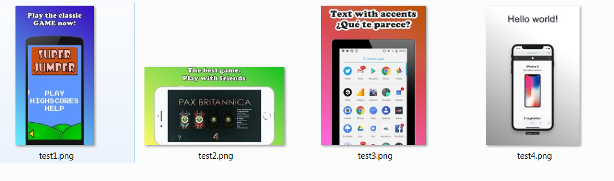
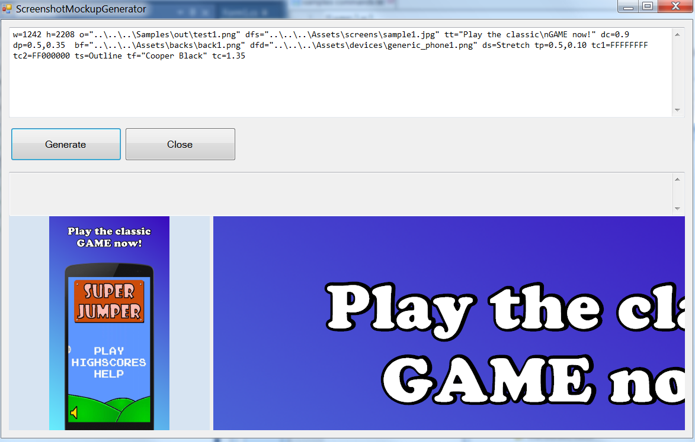
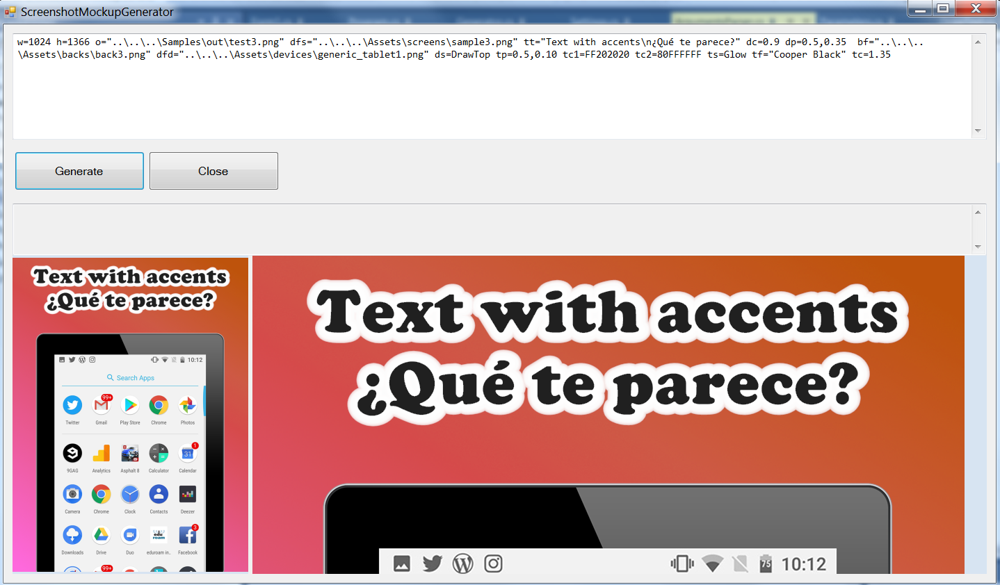
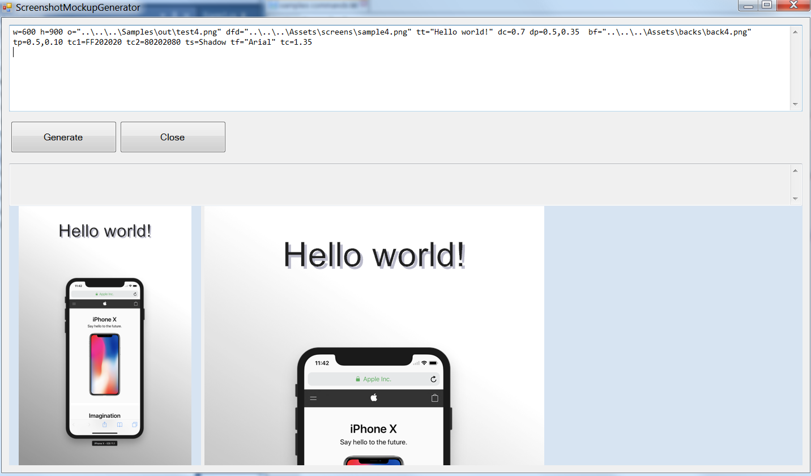

# Screenshot Mockup Generator

C# Windows Application to create atractive screenshots using 4 elements:
- Background image
- Device frame (Android, iPhone, iPad, etc)
- Screenshot of your awesome game/app
- Text

<p align="center">
  
</p>

The app can be run from command line so you can create a .bat file with all the screenshots for every languaje, device type, etc

# Usage
```
    W=   width  
    H=   height  
    O=   output_file
    OF=  format (PNG24|PNG32|JPG90|JPG80)

    BF=  background_file 
    BP=  background_position (*1) 
            
    DFD= device_file_device
    DFS= device_file_screenshot
    DS=  device_style (DrawTop|Stretch) 
    DP=  device_position (*1) 
    DC=  device_scale (*2) 
            
    TT=  text_text 
    TP=  text_position (*1) 
    TC1= text_color_fore (*3)
    TC2= text_color_back (*3)
    TS=  text_style (Simple|Shadow|Outline|Glow) 
    TST= text_style_thickness (*2)
    TF=  text_font (Windows font name) 
    TC=  text_scale (*2)
            
    *1: Position format can be two parameters (px,py) in percentaje, 0.5 middle or four (px,py,alignx,aligny)
        px,py  
        px,py,Left|Center|Right,Top|Center|Bottom

    *2: Scale and thickness: Default value is 1.0. 
            2.0 will produce a double-scale effect (2x)

    *3: Colors are in argb or rgb format: Example 0000FF -> Blue, FF404040 -> Dark gray
```

# Command line
You can create a batch file (.bat) to automate the task. [Sample here](https://github.com/DavidPDev/ScreenshotMockupGenerator/blob/80126273ab63bf13b78a01be9682fb403a340894/Samples/generate.bat).

# Version log
1.0 18 FEB 2019. Initial release

# Samples
**Sample1:**
```
w=1242 h=2208 o="..\..\..\Samples\out\test1.png" dfs="..\..\..\Assets\screens\sample1.jpg" tt="Play the classic\nGAME now!" dc=0.9 dp=0.5,0.35  bf="..\..\..\Assets\backs\back1.png" dfd="..\..\..\Assets\devices\generic_phone1.png" ds=Stretch tp=0.5,0.10 tc1=FFFFFFFF tc2=FF000000 ts=Outline tf="Cooper Black" tc=1.35
```
<p align="left">
  
</p>

**Sample2:**
```
w=1280 h=720 o="..\..\..\Samples\out\test2.png" dfs="..\..\..\Assets\screens\sample2.jpg" tt="The best game.\nPlay with friends" dc=0.9 dp=0.5,0.35  bf="..\..\..\Assets\backs\back2.png" dfd="..\..\..\Assets\devices\apple8_land.png" ds=Stretch tp=0.5,0.10 tc1=FFFFFFFF tc2=FF000000 ts=Outline tf="Cooper Black" tc=1.35
```
<p align="left">
  
</p>

**Sample3:**
```
w=1024 h=1366 o="..\..\..\Samples\out\test3.png" dfs="..\..\..\Assets\screens\sample3.png" tt="Text with accents\n¿Qué te parece?" dc=0.9 dp=0.5,0.35  bf="..\..\..\Assets\backs\back3.png" dfd="..\..\..\Assets\devices\generic_tablet1.png" ds=DrawTop tp=0.5,0.10 tc1=FF202020 tc2=80FFFFFF ts=Glow tf="Cooper Black" tc=1.35
```
<p align="left">
  
</p>

**Sample4:**
```
w=600 h=900 o="..\..\..\Samples\out\test4.png" dfd="..\..\..\Assets\screens\sample4.png" tt="Hello world!" dc=0.7 dp=0.5,0.35  bf="..\..\..\Assets\backs\back4.png" tp=0.5,0.10 tc1=FF202020 tc2=80202080 ts=Shadow tf="Arial" tc=1.35
```
<p align="left">
  
</p>
