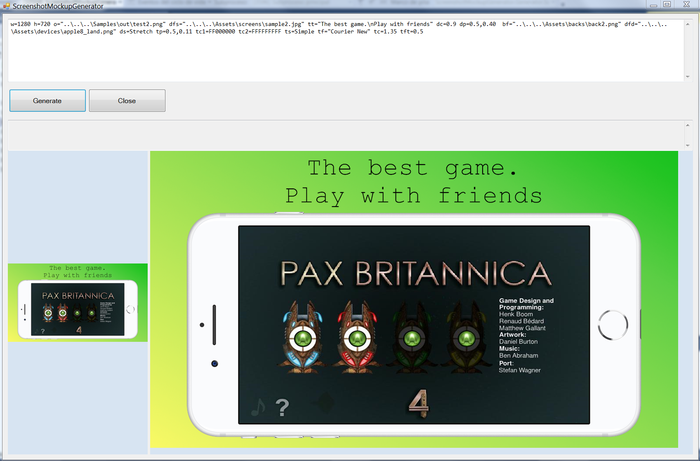

# Screenshot Mockup Generator

C# Windows Application to create atractive screenshots using 4 elements:
- Background image
- Device frame (Android, iPhone, iPad, etc)
- Screenshot of your awesome game/app
- Text

<p align="center">
  
</p>

The application can be run from command line so you can create a .bat file with all the screenshots for every languaje, device type, etc.

It is conceived as a simple utility as I didn't find any existing application that made this work decently.

I've used it to create the 7 screenshots of our company's App for Android phone + Android tablet + iPhone + iPad, in 3 different languajes: 7 * 4 * 3 = ***84 screenshots in a few seconds*** using a .bat script. The best part is that changing a screenshot, text, etc is just a few seconds of work.

# Disclaimers & TODOs
- I'm not a C# developer so code may not be beautiful at all :)
- I'm not native English. That explains many things.
- Maybe the code has very few comments... I prefer auto-documented code...
- This is my first time publishing a "real" project on Github so don't blame me too much.
- TODO: I'm too lazy to develop a Form with all the fields for each option. Maybe in a future I'll do it.
- TODO: Error controls

# Usage
This utility has two operating modes:
- ***Windowed/visual mode***: it uses a edit-box command line to preview quickly the images. When you have finished you can save your commands to create a .bat script.
- ***Command line***: just call the .exe using all the arguments (may be a lot, but some are optional). Windows can use up to 8192 chars in a single command line.

List of commands (samples below):
```
    W=   width  
    H=   height  
    O=   output_file
    OF=  format (PNG24|PNG32|JPG90|JPG80)

    BF=  background_file 
    BP=  background_position (*1) 
            
    DFD= device_file_device
    DFS= device_file_screenshot
    DS=  device_style (DrawTop|Stretch) 
    DP=  device_position (*1) 
    DC=  device_scale (*2) 
            
    TT=  text_text 
    TP=  text_position (*1) 
    TC1= text_color_fore (*3)
    TC2= text_color_back (*3)
    TS=  text_style (Simple|Shadow|Outline|Glow) 
    TST= text_style_thickness (*2)
    TF=  text_font (Windows font name) 
    TC=  text_scale (*2)
            
    *1: Position format can be two parameters (px,py) in percentaje, 0.5 middle or four (px,py,alignx,aligny)
        px,py  
        px,py,Left|Center|Right,Top|Center|Bottom

    *2: Scale and thickness: Default value is 1.0. 
            2.0 will produce a double-scale effect (2x)

    *3: Colors are in argb or rgb format: Example 0000FF -> Blue, FF404040 -> Dark gray
```

# Command line
You can create a batch file (.bat) to automate the task. [Sample here](https://github.com/DavidPDev/ScreenshotMockupGenerator/blob/80126273ab63bf13b78a01be9682fb403a340894/Samples/generate.bat).

# Tricks & Tips
- I've created the backgrounds by my own using the Paint.Net great application, must be a square size (ex: 1000x1000)
- The device-frame images have been obtained from other repositories or googleing
- A great tip when creating a .bat file is the use of variables. Example:
```
chcp 1252
set W="w=1242"
set H="h=2208"
set BF1="bf=D:\PROYECTS\DEVICES FRAMES\back1.png"
set BF2="bf=D:\PROYECTS\DEVICES FRAMES\back2.png"
set DFD="dfd=D:\PROYECTS\DEVICES FRAMES\iphone8_black.png"
set DS="ds=DrawTop"
set DP="dp=0.5,0.35"

set TP="tp=0.5,0.09"
set TC1="tc1=FFFFFFFF"
set TC2="tc2=CC000000"
set TS="ts=Shadow"
set TF="tf=Cooper Black"
set TC="tc=1.25"

set TT1en="Text sample in english"
set TT2en="Second slide text"
set TT1es="Texto de ejemplo en español"
set TT2es="Segundo texto"

ScreenshotMockupGenerator.exe dfs=en\iphone\1.png o=en\iphone\D1.png %TT1en% %W% %H% %BF1% %DFD% %DS% %DP% %TP% %TC1% %TC2% %TS% %TF% %TC%
ScreenshotMockupGenerator.exe dfs=en\iphone\2.png o=en\iphone\D2.png %TT2en% %W% %H% %BF2% %DFD% %DS% %DP% %TP% %TC1% %TC2% %TS% %TF% %TC%
ScreenshotMockupGenerator.exe dfs=es\iphone\1.png o=es\iphone\D1.png %TT1es% %W% %H% %BF1% %DFD% %DS% %DP% %TP% %TC1% %TC2% %TS% %TF% %TC%
ScreenshotMockupGenerator.exe dfs=es\iphone\2.png o=es\iphone\D2.png %TT2es% %W% %H% %BF2% %DFD% %DS% %DP% %TP% %TC1% %TC2% %TS% %TF% %TC%

```

# Code in C#
- To find out the rectangle where the screenshot will fit, we just use the middle point of the frame image, then we go left and right, and top and bottom to find the limits of the transparent middle rectangle. C# function :
```csharp
  // Find limits of a frame -> Transparent rectangle in the center (middle of image)
  public static Rectangle FindFrameLimits(Bitmap b)
  {
      int[] DX = { -1, 1, 0, 0 };
      int[] DY = { 0, 0, -1, 1 };

      if (b != null)
      {
          int cx = b.Width / 2;
          int cy = b.Height / 2;
          int x1 = cx, x2 = cx, y1 = cy, y2 = cy; // Limit points
          for (int i = 0; i < 4; i++)
          {
              int x = cx, y = cy;
              Color col;
              do
              {
                  if (x < 0 || x >= b.Width || y < 0 || y >= b.Height) break;
                  col = b.GetPixel(x, y);
                  x += DX[i];
                  y += DY[i];

              } while (col.A <= 10);       // Almost trasparent

              x1 = Math.Min(x1, x);
              x2 = Math.Max(x2, x);
              y1 = Math.Min(y1, y);
              y2 = Math.Max(y2, y);
          }
          return new Rectangle(x1, y1, x2 - x1, y2 - y1);
      }
      return Rectangle.Empty;
  }
```

# Version log
1.0 18 FEB 2019. Initial release

# Samples
| Sample 1 | Sample 2 | Sample 3 | Sample 4 |
:---------:|:---------:|:---------:|:---------:
 |  |  | 

**Sample1:**
```
w=1242 h=2208 o="..\..\..\Samples\out\test1.png" dfs="..\..\..\Assets\screens\sample1.jpg" tt="Play the classic\nGAME now!" dc=0.9 dp=0.5,0.35  bf="..\..\..\Assets\backs\back1.png" dfd="..\..\..\Assets\devices\generic_phone1.png" ds=Stretch tp=0.5,0.10 tc1=FFFFFFFF tc2=FF000000 ts=Outline tf="Cooper Black" tc=1.35
```
<p align="left">
  
</p>

**Sample2:**
```
w=1280 h=720 o="..\..\..\Samples\out\test2.png" dfs="..\..\..\Assets\screens\sample2.jpg" tt="The best game.\nPlay with friends" dc=0.9 dp=0.5,0.35  bf="..\..\..\Assets\backs\back2.png" dfd="..\..\..\Assets\devices\apple8_land.png" ds=Stretch tp=0.5,0.10 tc1=FFFFFFFF tc2=FF000000 ts=Outline tf="Cooper Black" tc=1.35
```
<p align="left">
  
</p>

**Sample3:**
```
w=1024 h=1366 o="..\..\..\Samples\out\test3.png" dfs="..\..\..\Assets\screens\sample3.png" tt="Text with accents\n¿Qué te parece?" dc=0.9 dp=0.5,0.35  bf="..\..\..\Assets\backs\back3.png" dfd="..\..\..\Assets\devices\generic_tablet1.png" ds=DrawTop tp=0.5,0.10 tc1=FF202020 tc2=80FFFFFF ts=Glow tf="Cooper Black" tc=1.35
```
<p align="left">
  
</p>

**Sample4:**
```
w=600 h=900 o="..\..\..\Samples\out\test4.png" dfd="..\..\..\Assets\screens\sample4.png" tt="Hello world!" dc=0.7 dp=0.5,0.35  bf="..\..\..\Assets\backs\back4.png" tp=0.5,0.10 tc1=FF202020 tc2=80202080 ts=Shadow tf="Arial" tc=1.35
```
<p align="left">
  
</p>
